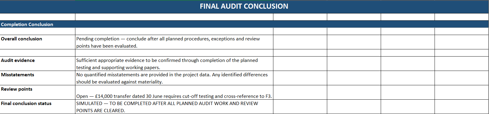

# Audit Working Papers

## 📌 Project Overview

This project is a **simulated end-to-end audit engagement for Meridian Trading Ltd**, created to demonstrate practical understanding of audit planning, materiality, risk assessment, controls testing, substantive testing, lead schedules and audit completion.

The project follows the audit workflow:

> **Understand the business → Set materiality → Assess risks → Plan responses → Test → Conclude**

> ⚠️ **Important:** Meridian Trading Ltd is a fictional company. This project is created for learning and portfolio purposes and does not represent an actual audit engagement, actual client information, audit evidence or an independent auditor's opinion.

---

## 🎯 Project Objective

The objective of this project is to demonstrate how an audit can be documented from the planning stage through completion using structured working papers.

The project covers:

* Audit planning
* Materiality assessment
* Risk assessment
* Audit assertions
* Controls testing
* Substantive testing
* Audit sampling
* Audit evidence
* Lead schedules
* Reconciliations
* Review points
* Audit completion
* Final simulated conclusion

---

# 📁 Project Structure

```text
audit-working-papers/
│
├── 01_Audit_Planning.xlsx
├── 02_Risk_Assessment.xlsx
├── 03_Controls_Testing.xlsx
├── 04_Substantive_Testing.xlsx
├── 05_Lead_Schedules.xlsx
├── 06_Completion.xlsx
├── Audit_Working_Papers_Final.xlsx
├── Audit_Report.docx
├── README.md
│
└── Screenshots/
    ├── Audit Planning & Materiality.png
    ├── Completion.png
    ├── Controls Testing.png
    ├── Revenue Lead Schedule.png
    ├── Risk Assessment.png
    └── Substantive Testing.png
```

---

# 1. Audit Planning

The audit planning workpaper establishes the engagement background, audit objectives, materiality, preliminary risks and overall audit strategy.

### Key Areas Covered

* Engagement details
* Company background
* Audit objectives
* Materiality
* Preliminary risk assessment
* Audit strategy
* Sign-off

---

# 2. Materiality

The project uses an illustrative profit before tax benchmark of **£1.2 million**.

| Measure                 | Basis                      |     Amount |
| ----------------------- | -------------------------- | ---------: |
| Profit Before Tax       | Illustrative benchmark     | £1,200,000 |
| Overall Materiality     | 5% of PBT                  |    £60,000 |
| Performance Materiality | 75% of Overall Materiality |    £45,000 |

### Materiality Calculation

```text
£1,200,000 × 5% = £60,000

£60,000 × 75% = £45,000

£45,000 ÷ £60,000 = 75%
```

These figures are used as an illustrative planning basis within the simulated engagement.

---

# 3. Risk Assessment

The risk assessment identifies areas where material misstatement could arise and links identified risks to planned audit responses.

## Revenue Recognition — High Risk

Key audit focus:

* Revenue cut-off
* Analytical review
* Supporting documentation
* Revenue recognition considerations

Revenue recognition is treated as a presumed fraud risk under ISA 240 within the project.

## Inventory Valuation — High Risk

Key audit focus:

* Inventory count procedures
* Inventory costing
* Net realisable value considerations
* Valuation evidence

## Management Estimates — Medium Risk

Key audit focus:

* Challenging management assumptions
* Obtaining supporting evidence
* Considering potential management bias

---

# 4. Audit Assertions

The working papers use the following key financial statement assertions:

* **Existence**
* **Completeness**
* **Valuation**
* **Rights & Obligations**
* **Cut-off**

Audit procedures are linked to relevant assertions to demonstrate a risk-based audit approach.

---

# 5. Controls Testing

The controls testing workpapers demonstrate how selected controls can be assessed for operating effectiveness.

Areas covered include:

* Revenue authorisation
* Year-end revenue cut-off
* Inventory count and costing
* Review of management estimates

## Controls Testing vs Substantive Testing

**Controls testing** assesses whether selected controls operate effectively.

**Substantive testing** focuses on whether recorded transactions and balances are appropriate and supported by audit evidence.

---

# 6. Substantive Testing

Substantive testing is organised into several key audit areas:

* Revenue
* Payables
* Cash
* Inventory
* Other balances

The procedures are designed to obtain audit evidence over relevant assertions and investigate exceptions or unusual items.

## Illustrative Cash Cut-off Review

The project includes an illustrative:

**£14,000 transfer dated 30 June**

This item requires:

* Cut-off testing
* Review of supporting evidence
* Cross-reference to working paper **F3**

This is an illustrative project scenario and does not represent an actual client transaction.

---

# 7. Lead Schedules

Lead schedules provide a structured link between trial balance amounts, audited amounts, differences and supporting working papers.

The project includes lead schedules for:

* Revenue
* Payables
* Cash
* Inventory

The cash lead schedule also includes the illustrative £14,000 transfer review point.

## Lead Schedule Purpose

Lead schedules demonstrate:

* Reconciliation of balances
* Identification of differences
* Supporting audit evidence
* Cross-referencing
* Audit conclusions
* Review points

---

# 8. Audit Completion

The completion workpaper brings together the results of the audit sections and outstanding review points.

It includes:

* Completion overview
* Summary of misstatements
* Review points
* Section conclusions
* Completion checklist
* Final audit conclusion
* Sign-off

## Final Conclusion

The final conclusion is intentionally dependent on completion of the planned audit work and evaluation of supporting evidence.

The project does **not** issue an actual audit opinion because complete client records, audit evidence and quantified misstatements are not provided.

---

# 📸 Project Screenshots

The following screenshots provide visual evidence of the working papers included in this project.

## Audit Planning & Materiality


## Risk Assessment


## Controls Testing


## Substantive Testing


## Revenue Lead Schedule


## Audit Completion



---

# 📂 Working Paper Index

| Reference          | Section                                   |
| ------------------ | ----------------------------------------- |
| **A**              | Audit Planning                            |
| **B**              | Risk Assessment & Materiality             |
| **C**              | Controls Testing                          |
| **D–G**            | Substantive Testing                       |
| **Lead Schedules** | Revenue, Payables, Cash & Inventory       |
| **Z**              | Completion & Conclusions                  |
| **F3**             | Illustrative Cash Transfer Cut-off Review |

---

# 🛠️ Tools Used

* **Microsoft Excel** — Audit working papers, calculations, reconciliations and documentation
* **Microsoft Word** — Audit report and documentation
* **GitHub** — Project version control and portfolio presentation

---

# 💼 Skills Demonstrated

## Audit & Accounting

* Audit planning
* Materiality assessment
* Risk assessment
* Audit assertions
* Controls testing
* Substantive testing
* Audit sampling
* Audit evidence
* Lead schedules
* Reconciliations
* Audit documentation
* Review procedures
* Audit completion

## Professional Skills

* Structured working-paper preparation
* Analytical thinking
* Risk-based approach
* Documentation and cross-referencing
* Professional presentation
* Attention to detail

---

# 📄 Project Deliverables

## Excel Working Papers

1. `01_Audit_Planning.xlsx`
2. `02_Risk_Assessment.xlsx`
3. `03_Controls_Testing.xlsx`
4. `04_Substantive_Testing.xlsx`
5. `05_Lead_Schedules.xlsx`
6. `06_Completion.xlsx`
7. `Audit_Working_Papers_Final.xlsx`

## Documentation

* `Audit_Report.docx`
* `README.md`

## Visual Evidence

* Audit Planning & Materiality
* Risk Assessment
* Controls Testing
* Substantive Testing
* Revenue Lead Schedule
* Audit Completion

---

# 📌 Portfolio Note

This project demonstrates a structured, risk-based approach to audit working papers through a simulated engagement.

The project demonstrates the workflow:

> **Planning → Risk Assessment → Controls → Substantive Testing → Lead Schedules → Completion**

All financial amounts and client information used where applicable are illustrative and should not be interpreted as actual client data.

---

# ⚠️ Disclaimer

This is a **fictional portfolio project** created for educational and professional-development purposes.

Meridian Trading Ltd is not presented as an actual audit client.

This repository does not represent:

* An actual audit engagement
* Actual client information
* Actual audit evidence
* An independent auditor's report
* An audit opinion
* An assurance conclusion

---

# 📊 Project Status

**Status:** Completed — Portfolio Project

**Track:** Audit & Assurance

**Level:** Intermediate

**Format:** Excel + Word + GitHub

**Engagement:** Simulated

**Client:** Meridian Trading Ltd
